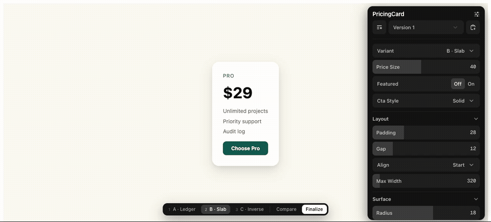
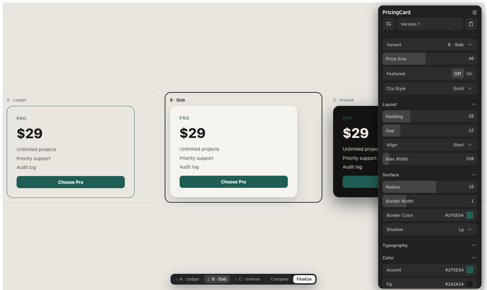

# VariantKit

**The configuration panel for AI-built UI.**

You: *"three takes on the pricing card."*
Your agent builds three real variants in your running app — wired to a full control panel
with every knob that matters: layout, surface, typography, color, motion. You switch with
keys 1-2-3, compare them side by side, drag sliders until it's right, hit **Finalize** —
and the losers are pruned from your codebase. What ships is a plain component with zero
tool residue.





Stop describing tweaks in chat. Tweak the thing, then hand your agent the decision.

## Install

From inside your project (Vite or Next.js, React 18+):

```sh
npx github:deepshal99/variantkit        # npm publish pending: npx variantkit
```

One command does everything:

- installs `dialkit` + `motion`
- copies the runtime (`buildDecision`, archetype schemas, `VariantBar`/`VariantStage`)
- wires the decision transport (Vite plugin or Next API route)
- mounts `<DialRoot/>` + `<VariantBar/>` in your app entry
- teaches your AI the contract (`AGENT.md` + a pointer in `CLAUDE.md`/`AGENTS.md`/Cursor rules)
- installs the global Claude Code skill (so every project gets variants proactively)

Check or undo anytime:

```sh
npx github:deepshal99/variantkit doctor   # 12 checks with fix-its
npx github:deepshal99/variantkit remove   # zero-residue uninstall (git-clean verified)
```

Flags: `--dry-run` `--skip-install` `--no-mount` `--no-skill` (init) · `--keep-deps` (remove)

## The loop

1. **Ask for options.** "Give me three takes on the hero." The agent scaffolds a variant
   set: 2-4 self-contained components + a thin shell wiring the panel.
2. **Get a real panel, not 3 sliders.** The agent authors the controls for YOUR element
   (VariantKit presents; the project decides) using **archetype checklists** per element
   type (`button · card · hero · navbar · modal · form · table · list · badge · pricing ·
   section`) — adapted, grouped in folders, every default seeded from your code.
3. **Explore.** Switch variants with the bottom bar or keys 1-9. **Compare** renders all
   variants in a live grid — drag a slider, every variant reacts.
4. **Finalize.** The decision (winner + your overrides — the taste signal) lands in
   `.variantkit/decisions/` via the dev server. No copy-paste. (Clipboard fallback when no
   transport is running.)
5. **"Apply decision."** The agent inlines your final values into the winner, renames it to
   `index.tsx`, deletes the losers and all tool wiring. Deterministic: deletion + one
   rename + literal inlining — no JSX surgery.
6. **It compounds.** Resolved decisions append to `.variantkit/history/`. After 3+, the
   agent distills `TASTE.md` — grounded observations ("radius lands 8-12, 3/3 decisions")
   that seed better defaults next time.

## Also in the box

- **Studio** — exploring several elements at once? One panel, a folder per element, each
  with its own controls and Finalize; hovering an element focuses its folder.
- **Snapshots** — keep two tunings of the same element (DialKit's preset toolbar) and
  switch between them; Finalize acts on the active one.
- **Panel polish** — dark mode with a header toggle, a delightful minimize/expand morph
  (shipped as a patch-package patch), micro-motion. All panel-side: nothing is ever drawn
  over your UI.

## Not just variants: paramify anything

*"Let me tweak this"* on any existing component wraps it in its archetype panel — no
variants, no registry. Tune it live, finalize, and the values inline back as literals with
the wiring stripped.

## Why not just ask the AI to build a switcher?

You can — every time, ad hoc, with 2-3 controls it happens to think of, and then ask it to
rip its own scaffolding back out and hope. VariantKit makes that loop a **contract**:
archetype panels with the controls the element actually needs, one keyboard-driven bar for
every set, a schema'd decision file, a prune algorithm with a self-check, and an uninstall
that leaves `git status` clean. Compared to Storybook knobs: this runs **in your real app**,
against real data and layout — and removes itself when you decide.

## How it relates to DialKit

[DialKit](https://github.com/joshpuckett/dialkit) answers *"what number should this be?"*
VariantKit answers *"which direction should this go?"* — and uses DialKit as its control
panel (documented store API only; no fork, no patches).

## Repo map

- `variantkit/` — what gets installed: `buildDecision.ts` (pure core), `configs.ts`
  (panel assembly), `schemas/` (sections + 11 archetype checklists), `react.tsx` (Studio +
  panel theme), `react/` (VariantBar, VariantStage), panel css, `patches/` (panel morph),
  `vite-plugin.mjs`, `templates/` (Next routes), `init.mjs` (init/doctor/remove), `skill/`
- `AGENT.md` — the agent contract: scaffold convention, authoring rules, decision schema
  (v2, dot-paths), prune + self-check, §7 completeness bar, deslop, taste memory
- `NAMING.md` — the vocabulary (one word per concept)
- `examples/sandbox/` — wired Vite example (PricingCard, 3 variants, 19-control panel);
  `examples/panel-studio/` — the Studio dogfood
- `fixture/` — prune before/after proof + taste distillation fixture

MIT.
